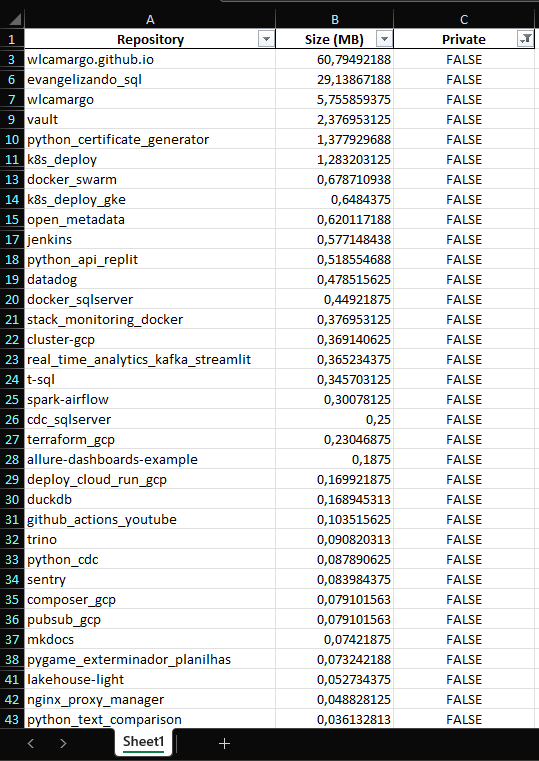

# Get Data from GitHub
 
## Arquitetura


## Pré-requisitos
* Python 3.10.12
* Libs do Python

## Como instalar os pré-requisitos?
Clone o repositório
```
git clone https://github.com/wlcamargo/get_data_from_github
```
Entre na pasta do projeto
```
cd get_data_from_github
```
Crie o ambiente virtual
```
python3 -m venv venv
```
Ative o ambiente virtual
```
source venv/bin/activate
```
No ambiente virtual instale as libs necessários
```
pip install -r requirements.txt
```

## Como executar o script?
```
python get_data_from_github.py
```

## O que vai acontecer?
Será gerada uma planilha com todos os seus repositórios públicos e privados e dizer o tamanho em MB de cada um.



## Referências
https://docs.github.com/en

## Developer
| Desenvolvedor      | LinkedIn                                   | Email                        | Portfólio                              |
|--------------------|--------------------------------------------|------------------------------|----------------------------------------|
| Wallace Camargo    | [LinkedIn](https://www.linkedin.com/in/wallace-camargo-35b615171/) | wallacecpdg@gmail.com        | [Portfólio](https://wlcamargo.github.io/)   |